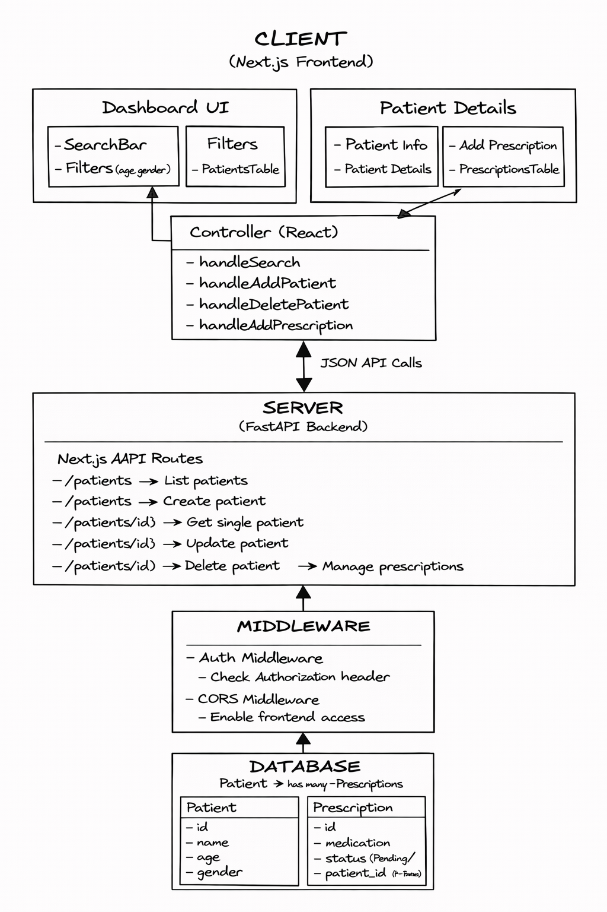

# Healthcare Platform

## Overview

## Approach

I approached this task by prioritizing the core patient and prescription CRUD operations, aiming to deliver the main functional requirements within the time available.

I focused on keeping the API structure simple and clear, with server-side filtering and pagination to support scalability.

Trade-offs were made (e.g. simplified authentication, patient details edit, containerisation), and I’ve outlined how these would be extended in a future production environment.

The backend supports updating/deleting patient and prescription data via API endpoints (see patients.py & prescriptions.py) although full editing functionality is not yet added in the frontend UI.

### Quick Notes

- The login and sign-up buttons are placeholders and will redirect to the patient dashboard, as full authentication is not implemented in this version.

- Clicking on a patient name opens their detail view, where associated prescriptions can be viewed and managed.

[GitHub Repository](https://github.com/TommeZ/healthcare-platform)

This application allows users to manage patients and their prescriptions.

Users can:

- Add and manage patient records
- Assign prescriptions to patients (accessible by clicking on a patient in the list)
- Update prescription statuses
- Search and filter patient data

The system is built with a Next.js frontend and FastAPI backend, demonstrating a clean separation of concerns.

## Technologies Used

- Frontend: Next.js (React), TypeScript, Tailwind CSS
- Backend: FastAPI (Python), SQLAlchemy ORM
- Database: SQLite
- API: RESTful architecture
- Validation: Pydantic schemas
- Middleware: Basic authentication handling

## Running the Application

### Backend (FastAPI)

1. Navigate to the backend folder:
   cd fastapi

2. Create a virtual environment:
   python -m venv venv

3. Activate the virtual environment:
   source venv/bin/activate (Mac/Linux)
   venv\Scripts\activate (Windows)

4. Install dependencies:
   pip install -r requirements.txt

5. Start the server:
   uvicorn api.main:app --reload

6. Open in your browser:
   http://localhost:8000/docs

---

### Frontend (Next.js)

1. Open a separate terminal & Navigate to the frontend folder:
   cd app

2. Install dependencies:
   npm install

3. Start the development server:
   npm run dev

4. Open in your browser:
   http://localhost:3000

---

### Notes

- The frontend communicates with the backend at:
  http://localhost:8000

- Ensure the backend is running before starting the frontend.

## Architecture Flowchart

This diagram shows the flow between the Next.js frontend, FastAPI backend, middleware, and database.

## Data Model (See models.py)

- Patient
  - id
  - name
  - age
  - gender

- Prescription
  - id
  - medication
  - status
  - patient_id (FK)

- MedicalReport
  - id
  - patient_id (FK)
  - type (blood pressure etc)
  - value
  - created_at

- User
  - id
  - email
  - role (Doctor, Pharmacist, Admin)

### Relationships

- Patient → has many → Prescriptions
- Patient → has many → MedicalReports
- User → can manage → Patients / Prescriptions

## Design Notes

### Authentication & Authorisation

- Implemented middleware to verify Authorization token for API routes.
- Kept authentication lightweight for this task. In production this would use proper authentication (e.g. JWT).
- Role based access (Doctor, Pharmacist, Admin) considered in the data model for future extension.

### Handling Sensitive Health Data

- Input validation is handled using Pydantic schemas
- Sensitive data access is restricted via middleware (authentication middleware)

### Scalability & Performance

- Backend APIs are stateless which is more scalable and enables horizontal scaling.
- Pagination (skip/limit) is used to efficiently handle large datasets.
- Filtering is performed at the database query level to reduce unnecessary data transfer.
- Database relationships are structured to support efficient joins (Patient → Prescriptions).

## Trade-offs & Future Improvements

- Authentication is implemented as middleware validating the presence of a token. In a production system, this would be replaced with a full authentication flow (e.g. JWT), including user registration, login, and role-based access control.

- Additional entities like MedicalReport and User/Role are defined at a high level but not fully implemented to prioritise core functionality.

- Filtering and pagination are implemented server-side. Further optimization such as indexing and caching using a store could be added for large datasets.

- The frontend focuses on essential user flows (search, filtering, CRUD operations). Additional features like editing patients and more advanced validation could be added.

- The application is designed to run locally using standard development tools.

- In a production environment, the app could be deployed to Vercel or other cloud services.

- Containerisation (e.g. Docker) could be added to ensure consistent environments.

- A production setup would likely use a persistent external database such as PostgreSQL instead of SQLite.

- CI/CD pipelines could be introduced to automate testing, builds, and deployments.
